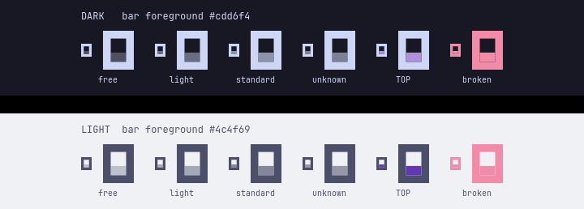
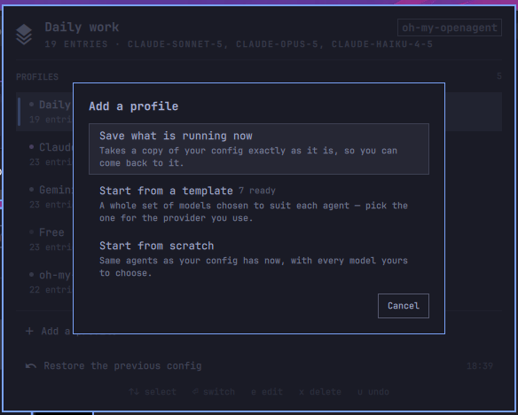
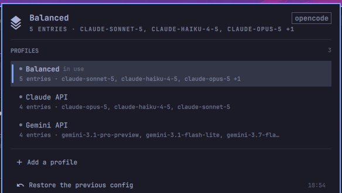
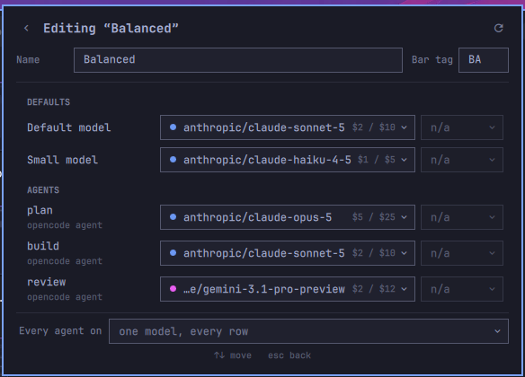
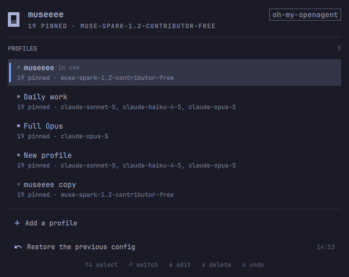
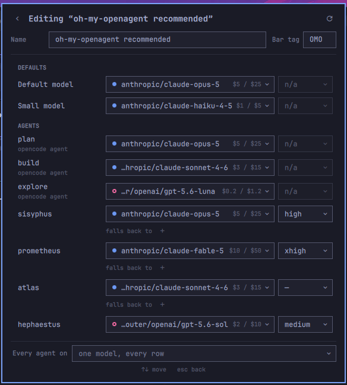
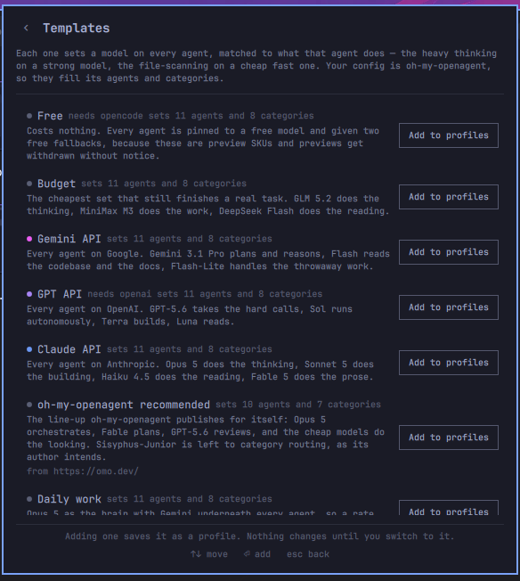
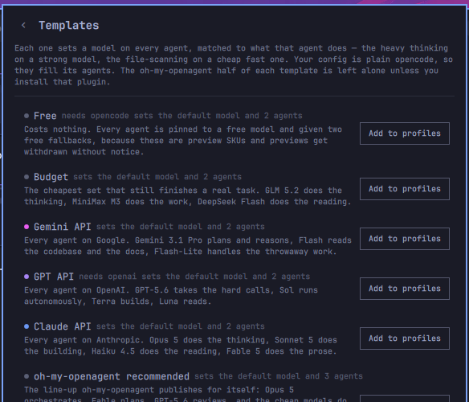
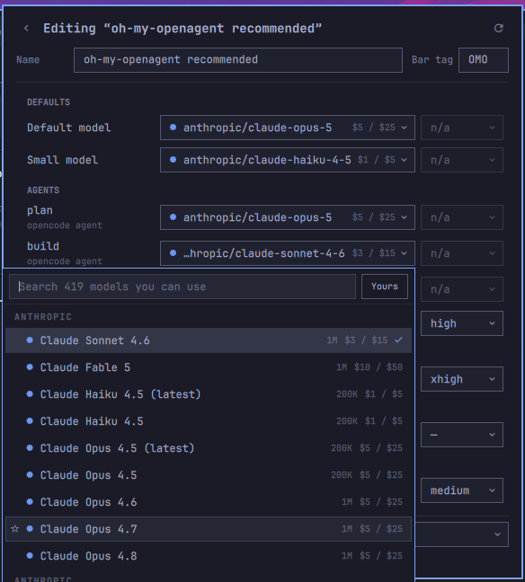

# OpenCode Config Manager

Saved opencode model profiles, one click from your Omarchy bar.

Keep a "daily work" set of models, a "full Opus" set for the hard afternoons, and a free one for
when you are just poking around. Click the bar to switch between them. Turn on **Restart opencode**
and a running session re-reads its config where it stands — nothing closes, nothing is lost.


Works with **classic opencode** and with **oh-my-openagent** — it reads your config rather than
carrying a list of its own, so it shows whatever is actually in the file, including agents you
added yourself. The pill in the top right of the panel says which of the two it found.

### What the mark is telling you

The icon is opencode's own mark, drawn rather than shipped as an image, so it takes the bar's
colours instead of fighting them. The frame stays your bar foreground and never moves: it is a
logo, and a logo that changes hue on every switch stops being one. The **cursor block inside it**
is the part that carries state.



Cost is ordinal, so it is one colour at graded strength rather than a palette of unrelated hues —
dim for free, brighter as the profile gets expensive, and opencode's own purple for the profile at
the top of your ladder. A config that will not parse turns the whole mark your theme's urgent
colour. It is the same grading the dots in the profile list use, so the bar and the panel are
never telling you two different things.

`mark-preview.qml` in the repository root renders every one of those states without starting the
shell — `qml6 mark-preview.qml` for a window, or `QT_QPA_PLATFORM=offscreen qml6 mark-preview.qml`
to regenerate the image above.

An Omarchy **Quattro** shell plugin (`bar-widget`). Needs `omarchy-shell`, `opencode`, and the
`jq`, `python3`, `flock`, `sha256sum` and `pgrep` an Arch install already has.

---

## Install

```bash
omarchy plugin add https://github.com/oliwier-xiao/opencode-config-manager.git --enable
```

`--enable` puts it straight on the bar and asks which side you want it on — left, center or right.
Leave the flag off and it installs disabled, so you can read the code first and turn it on later
with `omarchy plugin enable oliwier.opencode-configs`.

To remove it:

```bash
omarchy plugin remove oliwier.opencode-configs
```

Your opencode config stays as the last switch left it, and your profiles survive a reinstall —
[Removing it](#removing-it) says how to clear those too.

---

## Your first profile

You already have one. The first time the panel opens it saves whatever you are running as
**Current config**, so there is a copy of your setup before you change anything — and something to
come back to. Nothing is written to your opencode config to do that; it is only read.

To add more, press **Add a profile**. It offers three ways in:

| | |
|---|---|
| **Save what is running now** | another copy of your config as it is |
| **Start from a template** | a whole set of models already matched to each agent, for the provider you use |
| **Start from scratch** | the same agents your config has now, with every model yours to choose |



---

## Plain opencode

If you use opencode on its own, it manages the `model`, `small_model` and `agent` keys of
`~/.config/opencode/opencode.json`. That means opencode's own built-ins — `build`, `plan`,
`general`, `explore` and `scout` — plus any agent you have defined in that file's `agent` key: add
one and it appears here on the next panel open, with no configuration.



Every profile says how many entries it pins and to what. The dot on the left is what the profile
costs to run — dim for free, brighter as it gets expensive, and opencode's own purple for the
profile that is at the top of your ladder.

### Pinned is not the same as running

Neither config shape writes down an agent you have never overridden — both leave it on its own
default. So a file naming two agents still runs the whole roster, and a panel that listed only the
file would hide the rest behind nothing at all: you cannot pin an agent it never draws.

So the editor draws the whole roster. Your file's own entries come first, in the file's order, and
the rest follow as empty rows waiting for a model. The count in the summary only ever counts the
ones that actually pin something — `2 pinned` out of nineteen rows means two agents are held to a
model by you and seventeen are running on whatever their default is today. An agent the roster has
never heard of still shows up, because the file is read first and the roster only appends.

Editing one gives you every agent in the file, with the model, the reasoning effort, and what each
costs per million tokens:



The effort column is disabled on these rows on purpose: `opencode.json` wants a plain model
string, so there is nowhere to put an effort. It stays visible rather than vanishing, so the rows
keep lining up.

---

## With oh-my-openagent

If you run the [oh-my-openagent](https://github.com/code-yeongyu/oh-my-openagent) plugin, it also
manages `~/.config/opencode/oh-my-openagent.json` — every agent, every category, and the fallback
chain behind each one. It detects which of the two you have; you do not configure it.





Fallbacks are collapsed to one line per agent, because a fallback is a thing you set once and then
want to see is still there.

An agent that only exists as a markdown file in `~/.config/opencode/agent/` works in opencode but
does not appear here — opencode never writes those back into `opencode.json`, and this panel edits
the file. To manage one, add `"<name>": { "model": "..." }` under the `agent` key using the
markdown filename as the key. The prompt and permissions stay in the `.md`; only the model moves
into the JSON, and the two merge.

---

## Templates

Seven ready-made profiles ship with the plugin. Each one sets a model on every agent, matched to
what that agent actually does — the heavy thinking on a strong model, the file-scanning on a cheap
fast one — so someone who has just connected a key does not have to pick twenty models by hand.

| | |
|---|---|
| **Claude API** | Opus plans, Sonnet builds, Haiku looks things up |
| **Gemini API** | 3.1 Pro for the thinking, Flash for everything cheap. The lowest-cost coherent config in the catalogue |
| **GPT API** | the GPT-5 line, codex on the building agent |
| **Daily work** | a strong brain with cheap models doing the bulk, across providers |
| **Budget** | as cheap as it gets while still being pleasant |
| **Free** | costs nothing. Every agent gets two free fallbacks, because these are preview SKUs and previews get withdrawn |
| **oh-my-openagent recommended** | the line-up its author publishes on [omo.dev](https://omo.dev/), model for model |



Every template carries a half for each config shape, and only the half that matches your machine is
ever written — so on plain opencode the oh-my-openagent half is left alone, and no
`oh-my-openagent.json` is created. Each row says what it will actually set here:



Adding one saves it as a profile — nothing on disk changes until you switch to it, so you can read
it and edit it first. A template needing a provider you have not connected is still listed, with
the missing one named on the row.

---

## Picking a model



The list comes from your own opencode, so it holds exactly what your keys can reach — connect a
provider and its models appear here at the next refresh. Press <kbd>Tab</kbd> to search the whole
models.dev catalogue instead, for when you are deciding which provider to add next. (That
catalogue is filtered to models that can call tools and return text — the ones an agent can
actually use.) If your shell cannot run `opencode models` at all, the picker opens on the full
catalogue rather than on an empty list.

Each row carries the context window, the price per million in and out, and a mark for the vendor.
The mark's colour rotates off your theme's accent, so it follows a theme change; filled and hollow
alternate so the eight best-known vendors stay apart without relying on colour alone. Anything
else gets a neutral mark — the provider is written into every model id anyway.

- <kbd>↑</kbd> <kbd>↓</kbd> move, <kbd>Enter</kbd> pick, <kbd>Esc</kbd> close
- <kbd>*</kbd> star a model — starred models sort to the top everywhere
- <kbd>Tab</kbd> switch between "models you can use" and "every model there is"
- Type a `provider/model` id that is not in the list and it will still let you use it

---

## Switching, safely

A switch rewrites only the keys a profile claims. Everything else in the file comes back with the
same keys, in the same order, with the same values — your providers, your MCP servers, your plugin
list, your API keys, your agent prompts. The file is re-serialised, so indentation is normalised;
values and ordering are not touched.

Before every switch it copies the files it is about to touch. **Restore the previous config** in the
footer puts them back exactly as they were, and the undo is itself undoable.

If you edit a config by hand afterwards, the panel notices and says so rather than carrying on
claiming a profile that no longer describes anything:

> Your config has been edited since you switched to "Daily work".
> `[ Update "Daily work" ]  [ Save as new profile ]`

## Reloading opencode

opencode reads its config when it starts. With **Restart opencode** turned on, this plugin does not
restart it either — it sends the same `SIGUSR2` that Omarchy sends after a theme change, and
opencode re-reads its config in place. Your session, its history, and everything you had open
survive; the next message uses the new models.

Only the interactive TUI listens for that signal. A headless `opencode serve` does not, and the
default behaviour of `SIGUSR2` is to terminate — so each process is checked for the handler before
it is signalled, and a server you are running is left alone.

The default is **Notify**, which writes the files and tells you which sessions have not seen them.

`After switching a profile` in the widget's settings chooses between:

| | |
|---|---|
| **Notify** | write the files, and say what would need reloading. The default. |
| **Restart opencode** | write the files and ask every running TUI to re-read them, in place |
| **Nothing** | write the files and say nothing |

## Settings

Right-click the bar widget → Settings, or edit the entry in `~/.config/omarchy/shell.json`.

| Setting | Default | |
|---|---|---|
| `barLabel` | Profile name | what sits next to the bar icon: the profile's short tag, the model, or nothing |
| `afterSwitch` | Notify | see **Reloading opencode** above |
| `confirmSwitch` | off | ask before switching. Off is the fast path the bar is for |
| `manageOpencodeJson` | on | manage `model`, `small_model` and `agent` in `opencode.json` |
| `manageOhMyOpenAgent` | on | manage `agents`, `categories` and `fallback_models` in `oh-my-openagent.json` |
| `keepBackups` | 10 | copies kept of each config file, oldest deleted past this. The one Undo needs is never pruned |
| `catalogRefreshHours` | 24 | how often the model list is rebuilt |
| `showModelMeta` | on | show context window and price on every model row |
| `configDir` | — | point at a second set of config files, the way `OPENCODE_CONFIG_DIR` does. Each folder gets its own profiles |

## Keys

**Profile list** — <kbd>↑</kbd><kbd>↓</kbd> select · <kbd>Enter</kbd> switch · <kbd>e</kbd> edit ·
<kbd>d</kbd> duplicate · <kbd>x</kbd> delete · <kbd>u</kbd> undo · <kbd>r</kbd> refresh ·
<kbd>Esc</kbd> close. <kbd>/</kbd> focuses the search field, which appears once you have eight
profiles. The first press of a key that acts on a row lights the cursor rather than acting, so
nothing destructive lands on a selection you cannot see.

**Mouse** — left click opens the panel, middle click re-reads the config and the model list.
Scroll is deliberately unbound: a stray scroll over the bar must never rewrite your agent config.

---

## From a terminal

Everything the panel writes goes through one script, which you can run yourself:

```bash
~/.config/omarchy/plugins/oliwier.opencode-configs/bin/oc-profiles detect     # what is on disk
~/.config/omarchy/plugins/oliwier.opencode-configs/bin/oc-profiles list       # profiles + drift
~/.config/omarchy/plugins/oliwier.opencode-configs/bin/oc-profiles capture X  # save the live config
~/.config/omarchy/plugins/oliwier.opencode-configs/bin/oc-profiles seed       # first profile, if there are none
~/.config/omarchy/plugins/oliwier.opencode-configs/bin/oc-profiles apply X    # switch
~/.config/omarchy/plugins/oliwier.opencode-configs/bin/oc-profiles revert     # undo the last switch
~/.config/omarchy/plugins/oliwier.opencode-configs/bin/oc-profiles reload     # re-read config in place
```

It refuses rather than guesses: a config that will not parse, a `.jsonc` file it cannot edit safely,
a model id that is not `provider/model`, or a field the installed oh-my-openagent would silently
drop all stop the write before anything is touched. If a second file fails mid-switch, the first is
put back.

## Removing it

```bash
omarchy plugin remove oliwier.opencode-configs
```

That takes the widget off the bar and deletes the plugin. Two things it deliberately does not touch:

- **Your opencode config stays as it is.** Whatever profile you last switched to is still in effect,
  because it was written into your own files and is yours. To go back further, run
  `oc-profiles revert` before removing, or restore a copy from the backups folder below.
- **Your profiles and backups survive**, so reinstalling later finds them again. To clear them:

```bash
rm -rf ~/.local/state/omarchy/opencode-configs        # profiles and backups
rm -rf ~/.cache/omarchy/oliwier.opencode-configs      # the cached model list
```

## Where things live

| | |
|---|---|
| `~/.local/state/omarchy/opencode-configs/profiles.json` | your profiles, favourites and recents |
| `~/.local/state/omarchy/opencode-configs/backups/` | one folder per switch, with a copy of each file |
| `$XDG_CACHE_HOME/omarchy/oliwier.opencode-configs/models.json` | the model list, rebuilt on a timer |

Nothing is written inside the plugin folder, and nothing is written to `~/.config/opencode` except
the keys a profile claims.

The first and the last of those it reads under a ceiling, and on the descriptor it opened rather
than on the name — `omarchy-shell` is one process for every plugin on the desktop, so a file that
has been swapped for a symlink, a FIFO or a much bigger one is refused before a byte of it is read.

## License

MIT — see [LICENSE](LICENSE).
